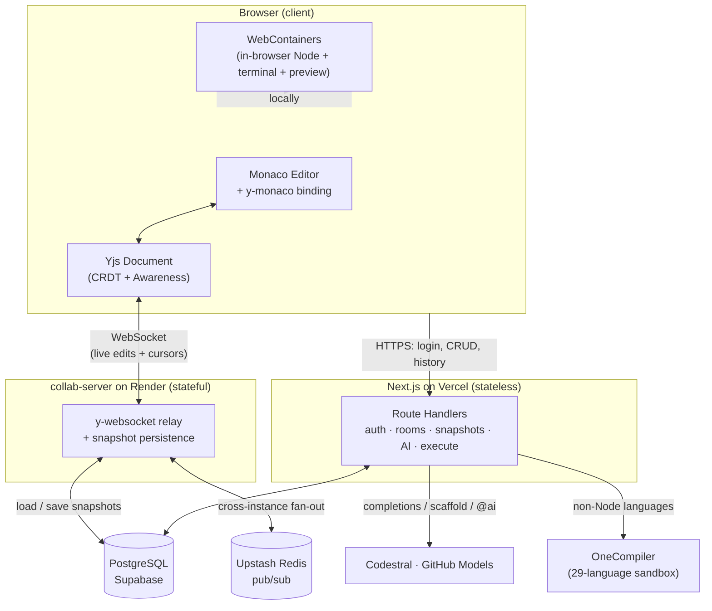

# Code-R — Real-Time Collaborative Code Editor

> A browser-based, multiplayer code editor with conflict-free live editing, in-browser code execution, and an AI pair-programmer — Google Docs for code.

<p align="center">
  <a href="https://code-r-ruby.vercel.app"></a>
</p>

<p align="center">
  
  
  
  
  
  
</p>

<p align="center">
  <strong><a href="https://code-r-ruby.vercel.app">▶ Open the Live Demo</a></strong>
</p>

---

## Overview

**Code-R** lets multiple developers edit the same codebase simultaneously in the browser — every keystroke syncs in real time with zero merge conflicts, thanks to a CRDT (Conflict-free Replicated Data Type) data model. Beyond editing, rooms can **run code in-browser** (a full Node.js runtime via WebContainers, plus a 29-language sandboxed executor), spin up **live dev-server previews**, and call an **AI assistant** for inline completions, project scaffolding, and chat commands.

The hard problem it solves: real-time collaboration is fundamentally **stateful** (persistent WebSocket connections, shared mutable document state), but modern serverless platforms like Vercel are **stateless**. Code-R splits the system into a stateless Next.js app and a dedicated stateful WebSocket server, with CRDT snapshots persisted to Postgres so nothing is ever lost.

## Key Features

- **Conflict-free real-time editing** — multiple users type in the same file simultaneously; edits merge deterministically via [Yjs](https://yjs.dev) CRDTs (no operational-transform server, no lock contention).
- **Live presence** — remote cursors, selections, and join/leave awareness, each collaborator color-coded.
- **Multi-file, polyglot workspaces** — a shared file tree backed by per-file CRDT documents; language auto-detected per file (29 languages), rendered as a nested folder tree.
- **In-browser code execution** — a full **WebContainers** Node.js runtime runs `npm install`, dev servers, and arbitrary scripts entirely client-side, with a real [xterm.js](https://xtermjs.org) terminal and **live preview pane** (HMR-capable). Non-Node languages execute via a sandboxed OneCompiler runtime.
- **AI pair-programmer** — inline FIM (fill-in-the-middle) completions (Codestral), one-shot project scaffolding, and collaborative `@ai` chat commands visible to the whole room (GitHub Models / `gpt-4o-mini`).
- **Version history** — automatic + named CRDT snapshots, point-in-time restore, and a side-by-side diff viewer.
- **Local folder sync** — two-way sync between a room and a real on-disk folder via the File System Access API (Chromium).
- **Auth & sharing** — GitHub / Google OAuth + email-password, account linking, role-based access (Owner / Editor / Viewer), public/private rooms, share links, and invitations.
- **GitHub Gist export** — one-click export of a room's files to a Gist.
- **Production hardening** — CSRF protection on every mutation, CSP/COOP/COEP headers, Zod-validated environment, Sentry monitoring, PostHog analytics.

## Tech Stack

<table>
<tr><th>Layer</th><th>Technology</th><th>Why</th></tr>

<tr><td rowspan="6"><strong>Frontend</strong></td>
<td>Next.js 16 (App Router) + React 19</td><td>Server Components for fast initial loads; route protection in middleware.</td></tr>
<tr><td>TypeScript 5</td><td>End-to-end type safety across API boundaries and CRDT payloads.</td></tr>
<tr><td>Monaco Editor</td><td>The VS Code editor core; bound to Yjs via <code>y-monaco</code>. CDN-pinned to avoid silent version drift.</td></tr>
<tr><td>Tailwind CSS v4 + shadcn/ui (Radix)</td><td>Accessible primitives + a token-driven design system (dark/light).</td></tr>
<tr><td>Zustand</td><td>Lightweight editor/UI state outside the CRDT.</td></tr>
<tr><td>GSAP · motion · ogl</td><td>Panel slide animations, a morphing search input, and a WebGL dashboard backdrop.</td></tr>

<tr><td rowspan="4"><strong>Backend</strong></td>
<td>Next.js Route Handlers (serverless)</td><td>Auth, room CRUD, AI proxying, execution, snapshots — deployed on Vercel.</td></tr>
<tr><td>NextAuth.js v5 + bcryptjs</td><td>OAuth + credentials, JWT sessions with hourly rotation.</td></tr>
<tr><td>Prisma 7 (PrismaPg driver adapter)</td><td>Type-safe data access; single-connection pool tuned for serverless Lambdas.</td></tr>
<tr><td>PostgreSQL (Supabase) + Zod v4</td><td>Relational store with RLS; runtime-validated env + request bodies.</td></tr>

<tr><td rowspan="4"><strong>Realtime</strong></td>
<td>Yjs CRDT + Yjs Awareness</td><td>Conflict-free document state + presence/cursor metadata.</td></tr>
<tr><td>y-websocket (standalone Node server)</td><td>Persistent WebSocket fan-out — what Vercel serverless can't hold.</td></tr>
<tr><td>Upstash Redis pub/sub</td><td>Cross-instance message relay for horizontal scaling of the collab server.</td></tr>
<tr><td>CRDT → Postgres snapshots</td><td>Durable document state; rooms survive server restarts and cold starts.</td></tr>

<tr><td rowspan="3"><strong>Runtime &amp; AI</strong></td>
<td>WebContainers + xterm.js</td><td>A full Node.js runtime + terminal in the browser — no backend compute cost.</td></tr>
<tr><td>OneCompiler (RapidAPI)</td><td>Sandboxed execution for 29 non-Node languages.</td></tr>
<tr><td>Codestral FIM · GitHub Models</td><td>Inline completions + scaffolding/chat — called via native <code>fetch</code>, no SDK bloat.</td></tr>

<tr><td rowspan="2"><strong>Infra &amp; Tooling</strong></td>
<td>Vercel · Render · Supabase · Upstash</td><td>App on Vercel, collab server on Render, Postgres on Supabase, Redis on Upstash.</td></tr>
<tr><td>Vitest · ESLint 9 · Prettier · Husky · GitHub Actions · Sentry · PostHog</td><td>Tests, lint/format gates, pre-commit hooks, CI, error monitoring, product analytics.</td></tr>
</table>

## Architecture

Code-R is split into a **stateless web tier** (Next.js on Vercel) and a **stateful realtime tier** (a standalone `y-websocket` server on Render). The browser holds the source of truth as a Yjs document: edits flow through the WebSocket server (which only relays and persists, never transforms), while all auth, persistence, AI, and execution requests hit Next.js API routes. The collab server snapshots each document to Postgres and uses Redis pub/sub to stay consistent across horizontally-scaled instances. Code execution happens **entirely in the user's browser** via WebContainers — there is no server-side compute path for running code.



> **Realtime tier:** the WebSocket server is a separate service — repo [`777yash/code-r-collab-server`](https://github.com/777yash/code-r-collab-server), live at [code-r-collab-server.onrender.com](https://code-r-collab-server.onrender.com).

## Getting Started

### Prerequisites

- **Node.js** ≥ 20 and npm
- A **PostgreSQL** database (e.g. a free [Supabase](https://supabase.com) project)
- OAuth apps for **GitHub** and **Google** (for social login)
- _Optional:_ API keys for OneCompiler (execution), Codestral / GitHub Models (AI), Upstash Redis (scaling)

### 1. Clone & install

```bash
git clone <your-repo-url>
cd coder
npm install
```

### 2. Configure environment

```bash
cp .env.example .env
```

<details>
<summary><strong>Environment variables</strong> (click to expand)</summary>

```bash
# --- Database (Supabase) ---
DATABASE_URL=""          # pooled connection (app runtime)
DIRECT_URL=""            # direct connection (Prisma migrations only)

# --- Auth ---
NEXTAUTH_URL="http://localhost:3000"
NEXTAUTH_SECRET=""       # `openssl rand -base64 32`
NEXT_PUBLIC_APP_URL="http://localhost:3000"
GITHUB_CLIENT_ID=""
GITHUB_CLIENT_SECRET=""
GOOGLE_CLIENT_ID=""
GOOGLE_CLIENT_SECRET=""

# --- Code execution & AI (all optional; features degrade gracefully if absent) ---
ONECOMPILER_RAPIDAPI_KEY=""               # 29-language sandboxed execution
CODESTRAL_API_KEY=""                      # inline AI completions
GITHUB_MODELS_TOKEN=""                    # AI scaffolding + @ai chat (PAT, `models: read`)
GITHUB_MODELS_MODEL="openai/gpt-4o-mini"

# --- Analytics (optional) ---
NEXT_PUBLIC_POSTHOG_KEY=""

# --- Realtime (required to connect to the collab-server) ---
# NEXT_PUBLIC_COLLAB_WS_URL="ws://localhost:1234"   # see ../collab-server
# NEXTJS_INTERNAL_SECRET=""                          # shared secret for snapshot API <-> collab-server
```

> **Note:** The realtime/collab variables above are documented in [`CLAUDE.md`](./CLAUDE.md) and consumed by the [collab-server](https://github.com/777yash/code-r-collab-server) — add them to run live collaboration locally.
>
> <!-- TODO: confirm NEXT_PUBLIC_COLLAB_WS_URL / NEXTJS_INTERNAL_SECRET are added to .env.example before publishing. -->

</details>

### 3. Set up the database

```bash
npx prisma migrate deploy   # apply migrations
npx prisma generate         # generate the typed client
```

### 4. Run the app

```bash
# Terminal 1 — the Next.js app
npm run dev                 # http://localhost:3000

# Terminal 2 — the realtime collab server (separate repo)
git clone https://github.com/777yash/code-r-collab-server.git
cd code-r-collab-server
npm install
npm run dev                 # ws://localhost:1234
```

### Useful scripts

```bash
npm run build         # production build
npm run test          # Vitest unit tests
npm run lint          # ESLint
npm run type-check    # tsc --noEmit
npm run format:check  # Prettier
```

## Engineering Highlights

These are the hard problems behind the demo — the parts I'm proud of.

<details open>
<summary><strong>1. Real-time collaboration on a serverless platform</strong></summary>

<br>

Vercel's serverless functions can't hold a persistent WebSocket or mutable in-memory state — yet collaboration needs both. I solved this by **splitting the architecture**: the Next.js app stays stateless on Vercel, while a dedicated `y-websocket` server (Node.js on Render) owns the live document fan-out.

- **Persistence without an always-on DB writer:** the collab server loads a CRDT snapshot from Postgres when the first client joins a room and writes it back when the last client leaves, plus an idle-aware 30-second interval save (it skips the write when the document's state vector is unchanged, so idle rooms cost zero DB writes).
- **Horizontal scaling:** multiple collab-server instances stay consistent via **Upstash Redis pub/sub**, with a per-process instance ID and an `applyingRemote` guard to prevent infinite self-echo loops. Redis is optional — absent, it gracefully degrades to single-instance mode.

</details>

<details>
<summary><strong>2. Running code in the browser (WebContainers + cross-origin isolation)</strong></summary>

<br>

To run Node projects (`npm install`, Vite/Express dev servers, live preview) without paying for backend compute, I integrated **WebContainers**, which requires **`SharedArrayBuffer`** and therefore **cross-origin isolation** (COOP `same-origin` + COEP `require-corp`).

- These headers break many things (cross-origin images, OAuth popups, CDN scripts), so I scoped them to **`/rooms` routes only** using **disjoint CSP matchers** — browsers enforce the _intersection_ of all CSP headers on a response, so the room CSP must be the only one on those routes.
- I built a **two-way virtual filesystem sync** between the Yjs file tree and the container FS (debounced per-file observers, path sanitization on collaborator-supplied filenames), plus a File System Access API bridge to persist to real disk.

</details>

<details>
<summary><strong>3. A compact, versioned CRDT snapshot format</strong></summary>

<br>

CRDT documents grow unbounded, and snapshots are stored as binary blobs in Postgres and shipped over the wire. I designed a **tagged binary codec** (`[0x59, 0x5A, flags, ...payload]`):

- The server encodes **V2 + gzip**; the browser encodes **V2 only** (no zlib in the client bundle); untagged legacy bytes are read as **V1** for full backward compatibility — **no migration required**.
- Snapshots power both version history (named + automatic, capped at 50 auto-saves per room) and a Monaco diff viewer for point-in-time restore.

</details>

<details>
<summary><strong>4. Taming the Monaco + Yjs lifecycle</strong></summary>

<br>

Binding the VS Code editor core to a CRDT across multi-file tab switches surfaced a class of disposal-ordering crashes (`TextModel disposed before DiffEditorWidget`, double-destroyed bindings).

- All Yjs imports are **dynamic** inside the editor-mount handler — a static import breaks SSR/webpack through the `y-monaco → monaco-editor` chain.
- I enforce a strict teardown order and use a `WeakSet`-based **double-destroy guard**, including for y-monaco's _internal_ `onWillDispose` destroy path that bypasses the normal cleanup.

</details>

## Roadmap

- [ ] Token streaming for `@ai` chat responses (currently rendered on completion)
- [ ] Executor failover when the `@ai`-triggering client disconnects mid-generation
- [ ] Password recovery / reset flow
- [ ] Provider unlinking in account settings (currently disabled to avoid lockout)
- [ ] Lift AI provider to a billable tier for production-grade rate limits
- [ ] Broaden WebContainer support / fallbacks for Safari (no `SharedArrayBuffer`)

---

<p align="center"><sub>Built with Next.js, Yjs, and WebContainers · <a href="https://code-r-ruby.vercel.app">Live Demo</a> · <a href="https://github.com/777yash/code-r-collab-server">collab-server</a></sub></p>
