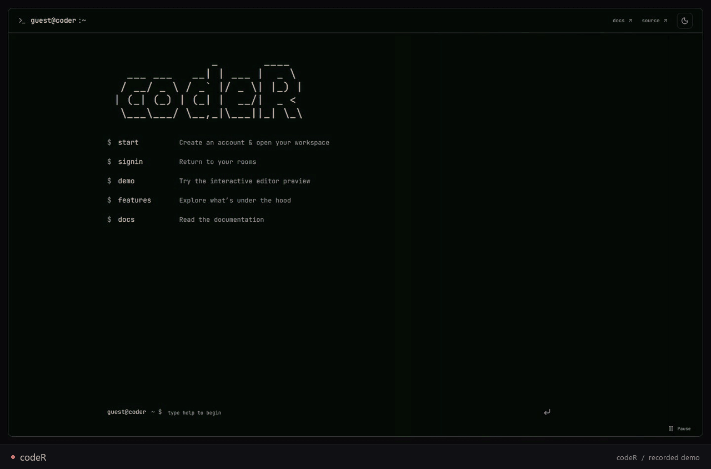
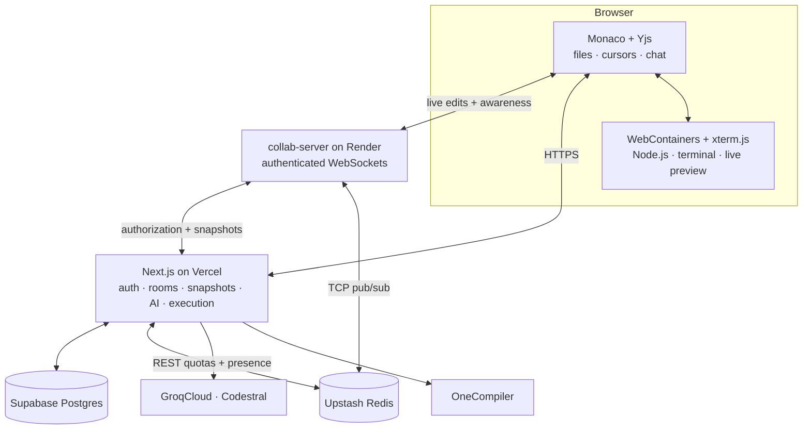

# Code-R — Real-Time Collaborative Code Editor

> A browser-based, multiplayer code editor with conflict-free live editing, in-browser code execution, and an AI pair-programmer — Google Docs for code.

<p align="center">
  
</p>

<p align="center">
  <a href="https://code-r-ruby.vercel.app"></a>
</p>

<p align="center">
  
  
  
  
  
  
</p>

## Overview

**Code-R** lets multiple developers work in the same codebase simultaneously, with edits merged through [Yjs](https://yjs.dev) CRDTs. Create a room, invite collaborators, open a multi-file workspace, and go from editing to running a project without leaving the browser. A built-in terminal, live preview, shared chat, and AI assistant keep the workflow in one place.

The hard problem it solves: real-time collaboration needs persistent WebSockets and shared document state, while a serverless app needs to stay stateless. Code-R splits those responsibilities between a **Next.js web app on Vercel** and a **dedicated Node.js collaboration server on Render**, with snapshots stored in **Supabase Postgres** and Redis relaying edits and awareness across server instances.

## Key Features

- **Conflict-free collaboration** — Monaco Editor bound to Yjs, with live cursors, selections, and collaborator presence.
- **Multi-file workspaces** — nested file trees, tabs, automatic language detection, and execution support for 29 languages.
- **Run and preview** — WebContainers runs Node.js projects, package installs, and dev servers in the browser, with an xterm.js terminal and live preview. Other supported languages run through OneCompiler.
- **AI pair-programmer** — Codestral inline completions, GroqCloud project scaffolding, and shared `@ai` chat for code explanations, file changes, and commands.
- **Version history** — automatic and named snapshots, side-by-side diffs, and point-in-time restore.
- **Local folder sync** — connect a real folder to the room through the File System Access API in supported Chromium browsers.
- **Rooms and sharing** — public/private visibility, invitations, share links, and Owner / Editor / Viewer roles enforced by both the API and WebSocket server.
- **Auth and Gist export** — GitHub, Google, and email/password sign-in, authenticated account linking, and multi-file GitHub Gist export with a reconnect flow when permissions expire.
- **A focused interface** — a full terminal-style home page, responsive editor, dark/light themes, restrained motion, and a lazily loaded ThreeUI CRT background.
- **Validation and monitoring** — bounded requests, validated snapshots, shared inline-completion quotas, CSRF protection, route-specific security headers, Sentry, and optional PostHog analytics.

## Tech Stack

| Layer                | Technology                                                                                                    |
| -------------------- | ------------------------------------------------------------------------------------------------------------- |
| Web app              | Next.js 16 App Router, React 19, TypeScript 5                                                                 |
| Interface            | Tailwind CSS v4, shadcn/ui, Radix UI, Lucide, Zustand, GSAP, Motion, OGL, ThreeUI CRT (raw WebGL + Canvas 2D) |
| Editor and realtime  | Monaco Editor, Yjs, y-monaco, y-websocket, Yjs Awareness                                                      |
| Authentication       | Auth.js / NextAuth v5, Prisma Adapter, GitHub and Google OAuth, bcryptjs, JWT sessions                        |
| Database             | Supabase PostgreSQL, Prisma 7, PrismaPg adapter, node-postgres                                                |
| Collaboration server | Node.js, TypeScript, ws, y-websocket server utilities, y-protocols, lib0, ioredis, dotenv                     |
| Code execution       | WebContainers, xterm.js, OneCompiler through RapidAPI                                                         |
| AI                   | GroqCloud for chat/scaffolding, Codestral for inline FIM completions, native fetch, Zod validation            |
| Infrastructure       | Vercel, Render, Upstash Redis TCP pub/sub and REST API                                                        |
| Tooling              | Vitest, ESLint 9, Prettier, Husky, lint-staged, GitHub Actions, Sentry, PostHog                               |

Supabase hosts the database; application authentication is handled by Auth.js, and live document synchronization runs through the separate collaboration server.

## Architecture

The browser maintains a shared Yjs document for files and room activity. The collaboration server authenticates connections, checks write permissions, relays updates, and persists snapshots through internal Next.js API routes. Next.js owns database access, room membership, OAuth, AI requests, and the remote execution proxy.


```mermaid
flowchart TD
    subgraph Browser["Browser"]
        Editor["Monaco + Yjs<br/>files · cursors · chat"]
        Runtime["WebContainers + xterm.js<br/>Node.js · terminal · live preview"]
    end

    App["Next.js on Vercel<br/>auth · rooms · snapshots · AI · execution"]
    Collab["collab-server on Render<br/>authenticated WebSockets"]
    DB[("Supabase Postgres")]
    Redis[("Upstash Redis")]
    AI["GroqCloud · Codestral"]
    Exec["OneCompiler"]

    Editor <-->|"live edits + awareness"| Collab
    Editor <-->|"HTTPS"| App
    Collab <-->|"authorization + snapshots"| App
    App <--> DB
    Collab <-->|"TCP pub/sub"| Redis
    App <-->|"REST quotas + presence"| Redis
    App --> AI
    App --> Exec
    Editor <--> Runtime
```

The realtime tier lives in [`777yash/code-r-collab-server`](https://github.com/777yash/code-r-collab-server). Node.js execution stays in the browser; OneCompiler handles the remote execution path for other supported languages.

## Getting Started

Use Node.js 20.19+ and npm, a PostgreSQL database, and GitHub/Google OAuth apps. Start by cloning and creating the local environment file:

```bash
git clone https://github.com/777yash/codeR.git coder
cd coder
npm ci
cp .env.example .env
```

On PowerShell, use `Copy-Item .env.example .env` instead of `cp`. Fill in the following values; keep credentials in `.env` and your deployment's server environment.

<details>
<summary><strong>Environment variables</strong></summary>

```dotenv
# Supabase Postgres: runtime connection and migration connection
DATABASE_URL=""
DIRECT_URL=""

# Auth and app URLs
AUTH_URL="http://localhost:3000"
NEXTAUTH_URL="http://localhost:3000"
NEXTAUTH_SECRET=""
NEXT_PUBLIC_APP_URL="http://localhost:3000"
GITHUB_CLIENT_ID=""
GITHUB_CLIENT_SECRET=""
GOOGLE_CLIENT_ID=""
GOOGLE_CLIENT_SECRET=""

# Collaboration: use the same random secret on both services (32+ characters)
NEXT_PUBLIC_COLLAB_WS_URL="ws://localhost:1234"
NEXTJS_INTERNAL_SECRET=""

# GroqCloud chat/scaffolding and Codestral inline completions
GROQ_API_KEY=""
GROQ_MODEL="openai/gpt-oss-120b"
CODESTRAL_API_KEY=""

# Shared inline-completion quotas and HTTP presence
UPSTASH_REDIS_REST_URL="https://your-database.upstash.io"
UPSTASH_REDIS_REST_TOKEN=""

# Remote code execution and optional analytics
ONECOMPILER_RAPIDAPI_KEY=""
NEXT_PUBLIC_POSTHOG_KEY=""
```

</details>

For Supabase, use a pooled `DATABASE_URL` for the serverless runtime and a direct or session-pooler connection in `DIRECT_URL` for Prisma migrations. See the [Supabase Prisma guide](https://supabase.com/docs/guides/database/prisma) for connection options. This repository's `prisma.config.ts` uses `DIRECT_URL` for the CLI.

Register OAuth callbacks at `http://localhost:3000/api/auth/callback/github` and `http://localhost:3000/api/auth/callback/google`, with equivalent URLs for your deployed app. GitHub sign-in requests the `gist` scope for export. Matching email addresses do not automatically merge accounts; linking requires signing in to the existing account first.

`GROQ_MODEL` is optional: chat and scaffolding default to `openai/gpt-oss-120b`, with `openai/gpt-oss-20b` also supported. These features need `GROQ_API_KEY`; inline completions use `CODESTRAL_API_KEY`. Remove `CODESTRAL_API_KEY` from `.env` if you aren't configuring inline completions. HTTP presence and inline-completion quotas require the Upstash REST credentials. The collaboration server uses a separate **native Redis TCP URL**, not the REST URL. AI and remote execution features return configuration errors when their required services are missing.

Apply the existing database migrations, then start the app:

```bash
npx prisma migrate deploy
npx prisma generate
npm run dev
```

In a second terminal, clone the collaboration server alongside this repository and follow its [setup instructions](https://github.com/777yash/code-r-collab-server#setup). Both services need the same `NEXTJS_INTERNAL_SECRET`; the server must be able to reach this app at `NEXTJS_API_URL`. Open `http://localhost:3000` once both are running. Use HTTPS/WSS and your deployed URLs in production, and deploy both services together.

```bash
npm test              # Vitest tests
npm run lint          # ESLint
npm run type-check    # TypeScript
npm run format:check  # Prettier
npm run build         # Production build
npm start             # Serve the production build
```

## Engineering Highlights

**Authenticated realtime, beyond the UI.** Room connections use short-lived, room-specific tickets checked against current database permissions before a WebSocket opens. Viewers can read and publish their own cursor, while document writes require Owner/Editor access. Access is rechecked during the connection, and role changes trigger a fresh editor session.

**A Redis mesh for edits and awareness.** Server instances relay document updates and authenticated presence, exchange state with existing peers when a room joins, and resynchronize after Redis reconnects. Origin markers prevent relay loops. Without a native Redis URL, the server runs in single-instance mode.

**Persistence that handles deletion-only edits.** Snapshots load on first join, save on last leave, and run every 30 seconds when the document changes. Autosave tracks update revisions rather than only Yjs state vectors, so deletions are included; failed writes remain pending for retry. Version history keeps the latest 50 automatic snapshots alongside named versions.

**A validated, versioned snapshot codec.** The server writes tagged V2 + gzip snapshots; the browser writes V2 without compression, and legacy V1 snapshots remain readable. Both services validate the workspace schema before accepting or restoring state, cap binary bodies at 5 MiB and gzip expansion at 32 MiB, and preserve corrupt stored data instead of overwriting it with an empty document.

**Browser execution with deliberate lifecycle management.** WebContainers uses cross-origin isolation scoped to room routes. Run waits for workspace writes before launching a command, while Monaco/Yjs bindings are disposed in a defined order across tab switches. Decorative rendering is deferred and suspended when hidden, paused, or reduced motion is enabled.

## Roadmap

- [ ] Stream `@ai` responses as they arrive
- [ ] Recover an AI task when its triggering client disconnects
- [ ] Add password recovery and safe provider unlinking
- [ ] Improve browser fallbacks for local execution and folder sync

---

<p align="center"><sub>Built with Next.js, Yjs, and WebContainers · <a href="https://code-r-ruby.vercel.app">Live Demo</a> · <a href="https://github.com/777yash/code-r-collab-server">collab-server</a></sub></p>
